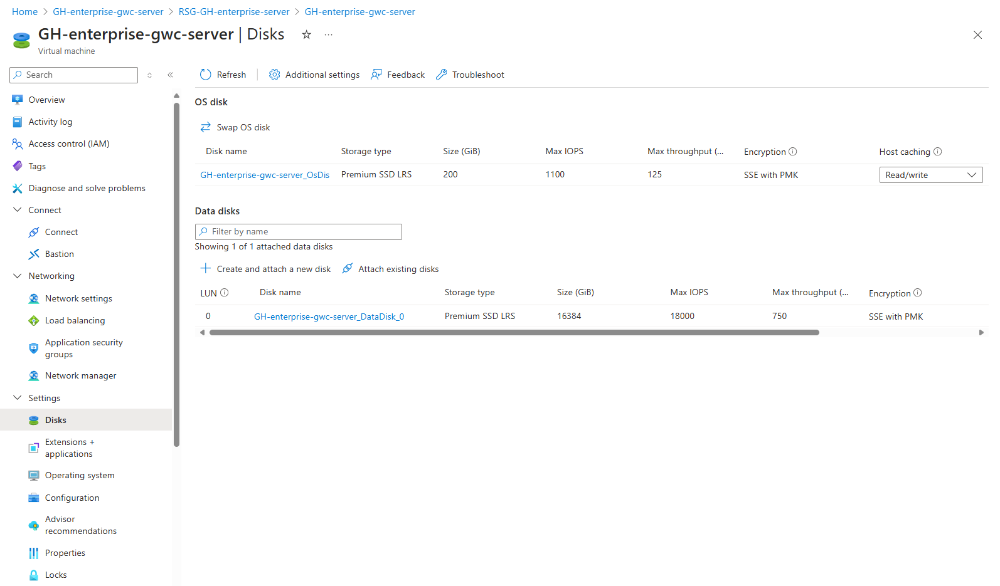
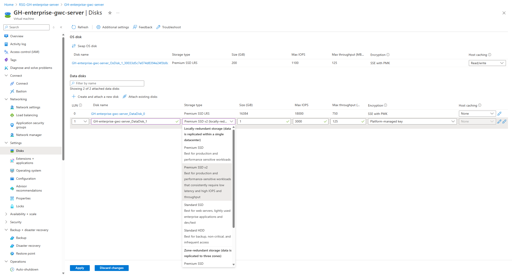
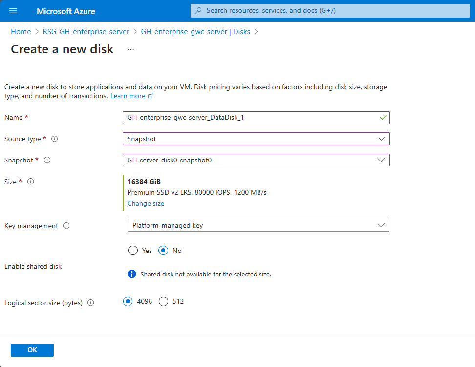

# How to Upgrade a Data Disk using a Snapshot

## Step 1: Access Disk Settings

1. Navigate to the **Settings** section and select **Disks**.
   
   

2. Click on the disk name to view detailed information.
3. Note the following details:
   - Disk type: P70 Premium SSD
   - Redundancy option: LRS
   - Size: 16364GB

4. Click on **Create snapshot**.

   

## Step 2: Create a Snapshot

1. In the snapshot creation page, fill in the required fields:
   - **Name**: Provide a name for the snapshot.
   - **Snapshot type**: Keep it as "**Incremental**".
2. Click on **Review + Create**.

   

## Step 3: Create a Disk from the Snapshot and Attach the Disk

### Create a New Disk

1. Return to the **Settings/Disks** page.
2. Click on **Create and attach a new disk**.

   

3. A new disk item will appear in the view.
4. Select the desired **Storage type**. To upgrade the old disk, select **Premium SSD v2**.

   
   

5. Fill in the required fields to create the new data disk:
   - **Name**: Provide a name for the new disk.
   - **Source type**: Select **Snapshot** from the dropdown.
   - **Size**: Adjust if necessary.
   - Click on **Review + Create**.

   
   

### Change Disk Size (if needed)

1. Click on **Change size**.
2. Select the desired **Storage type** (e.g., Premium SSD v2).

   

3. Update or keep the disk size.
4. Input **Disk IOPS** and **Disk throughput** based on the maximum values available for your disk type - see above the provisioned values.

   

5. Confirm the values are correct in the **Size** section and click **OK**.

   

## Step 4: Verify and Attach the New Disk

1. Check that the new disk item reflects the updated values regarding storage type, size, IOPS, and throughput.

   

2. Click **Apply** to attach the new disk.

   

## Step 5: Detach the Old Disk

> **Note:** Before detaching the old disk, ensure the background copy process of the new disk is complete to avoid [performance impacts](https://learn.microsoft.com/en-us/azure/virtual-machines/scripts/create-managed-disk-from-snapshot#performance-impact---background-copy-process) dute to latency. 
* You can use the *CompletionPercent* property to check the status of the background copy for Ultra Disks and Premium SSD v2 disks.

   

1. Wait until the background copy is 100% completed.

### Detach the Old Disk

1. Click the **detach** icon for the old disk.

   

2. Click **Apply** to confirm the detachment.

   

